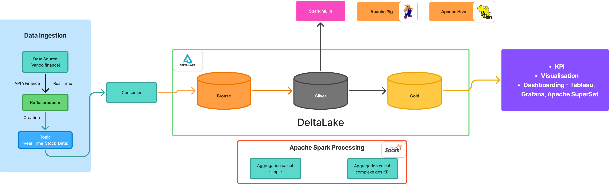

# Data Storage Layer Design for FinanceLake

## Overview
This document outlines the design of a data storage layer for FinanceLake, a data lake solution optimized for storing cleaned and processed financial data in a structured format. The layer is designed to support analytical queries with high performance, scalability, and reliability.

## Architecture Diagram

### High-Level Architecture



*Figure 1: High-level architecture of the FinanceLake data storage layer*

### Detailed Architecture Components

```
┌─────────────────────────────────────────────────────────────────────────────┐
│                            FinanceLake Data Lake                            │
│                                                                             │
│  ┌─────────────────────────────────────────────────────────────────────────┐ │
│  │                          Data Sources                                  │ │
│  │  (APIs, Databases, Files, Streams)                                      │ │
│  └─────────────────────────────────────────────────────────────────────────┘ │
│                                                                             │
│  ┌─────────────────────────────────────────────────────────────────────────┐ │
│  │                    Apache Spark Processing Engine                       │ │
│  │  - Data Ingestion (Structured Streaming)                               │ │
│  │  - ETL Transformations                                                  │ │
│  │  - Data Quality Validation                                              │ │
│  └─────────────────────────────────────────────────────────────────────────┘ │
│                                                                             │
│  ┌─────────────────────────────────────────────────────────────────────────┐ │
│  │                       Delta Lake Storage Layer                         │ │
│  │                                                                         │ │
│  │  ┌─────────────┐  ┌─────────────┐  ┌─────────────┐                     │ │
│  │  │ Bronze Layer│  │ Silver Layer│  │ Gold Layer │                     │ │
│  │  │ - Raw Data  │  │ - Processed │  │ - Analytics│                     │ │
│  │  │ - Partitioned│  │ - Enriched │  │ - Aggregated│                     │ │
│  │  │ by date/region│  │ - Business │  │ - Optimized│                     │ │
│  │  └─────────────┘  │ Logic Applied│  │ for Queries│                     │ │
│  │                    └─────────────┘  └─────────────┘                     │ │
│  └─────────────────────────────────────────────────────────────────────────┘ │
│                                                                             │
│  ┌─────────────────────────────────────────────────────────────────────────┐ │
│  │                    Amazon S3 Storage Backend                           │ │
│  │  - Distributed File System                                             │ │
│  │  - Partitioned Storage (date=YYYY-MM-DD/region=XX/)                    │ │
│  │  - Cross-Region Replication                                            │ │
│  │  - Versioning & Lifecycle Policies                                     │ │
│  └─────────────────────────────────────────────────────────────────────────┘ │
│                                                                             │
│  ┌─────────────────────────────────────────────────────────────────────────┐ │
│  │                      Query & Analytics Layer                           │ │
│  │  - Apache Spark SQL                                                    │ │
│  │  - BI Tools (Tableau, Power BI)                                        │ │
│  │  - ML/AI Workloads                                                     │ │
│  │  - Real-time Dashboards                                                │ │
│  └─────────────────────────────────────────────────────────────────────────┘ │
└─────────────────────────────────────────────────────────────────────────────┘
```

### Data Flow Architecture

```
Data Sources → Apache Spark → Delta Lake Layers → S3 Storage → Analytics Tools

Detailed Flow:
1. Raw data ingestion via Spark Structured Streaming
2. Data cleansing and initial partitioning (Bronze)
3. Business logic application and enrichment (Silver)
4. Aggregation and optimization for analytics (Gold)
5. Query optimization with partitioning and Z-ordering
6. Backup and disaster recovery via S3 features
```

### Performance Optimization Architecture

```
Query Optimization Stack:
├── Partition Pruning (date/region filters)
├── Z-Ordering (multi-dimensional clustering)
├── Bloom Filters (point lookups)
├── Caching Layer (Spark + S3 Intelligent Tiering)
└── Compaction (file size optimization)
```

## Data Format Choice: Delta Lake with Medallion Architecture

### Chosen Format: Delta Lake
We have selected **Delta Lake** as the primary data format for the storage layer. Delta Lake is an open-source storage layer that brings ACID transactions, scalable metadata handling, and unified streaming and batch data processing to data lakes built on top of cloud storage.

### Justification
- **Performance de requête**: Delta Lake supports efficient querying through its columnar storage format (Parquet-based) and optimized metadata. It enables fast analytical queries with features like data skipping, Z-ordering, and bloom filters.
- **Efficacité de stockage**: Uses Parquet format for columnar compression, reducing storage costs by 3-5x compared to traditional formats. Automatic compaction and optimization features help maintain efficient storage over time.
- **ACID Transactions**: Ensures data consistency and reliability for concurrent reads and writes.
- **Time Travel**: Allows querying historical data versions, crucial for financial auditing and compliance.
- **Schema Enforcement**: Prevents data corruption by enforcing schemas.

### Medallion Architecture

We implement a **medallion architecture** with three layers:
- **Bronze Layer**: Raw, cleaned data in its original format
- **Silver Layer**: Processed, enriched data with business logic applied
- **Gold Layer**: Aggregated, analytics-ready data optimized for reporting and dashboards

## Storage Architecture

### Distributed File System: Amazon S3
We use **Amazon S3** as the underlying distributed file system for the following reasons:
- **Scalability**: Virtually unlimited storage capacity and throughput
- **Durability**: 99.999999999% (11 9's) durability
- **Cost-Effectiveness**: Pay-as-you-go pricing with lifecycle policies for cost optimization
- **Integration**: Native integration with AWS analytics services and Delta Lake
- **Security**: Fine-grained access controls, encryption at rest and in transit

### Alternative: HDFS
HDFS could be used in on-premises deployments, but S3 provides better scalability and managed services for cloud-native data lakes.

## Data Organization and Partitioning

### Partitioning Strategy
Data is partitioned based on frequently queried columns to optimize query performance:

- **Primary Partitioning**: By `date` (partitioned by year/month/day for temporal queries)
- **Secondary Partitioning**: By `region` (geographic partitioning for regional analytics)
- **Additional Partitioning**: By `data_type` (e.g., transactions, balances, market_data)

Example partition structure:
```
s3://financelake-data/
├── bronze/
│   ├── transactions/
│   │   ├── date=2024-01-01/
│   │   │   ├── region=US/
│   │   │   └── region=EU/
│   │   └── date=2024-01-02/
│   └── balances/
├── silver/
│   ├── enriched_transactions/
│   └── customer_profiles/
└── gold/
    ├── daily_summaries/
    └── risk_metrics/
```

## Performance Optimization

### Techniques Implemented
1. **Partitioning**: As described above, reduces data scanning for queries
2. **Z-Ordering**: Optimizes data layout for multi-dimensional queries by co-locating related data
3. **Bloom Filters**: Accelerates point lookups and equality queries
4. **Caching**: 
   - Spark caching for frequently accessed datasets
   - S3 Intelligent Tiering for automatic cost optimization
5. **Compaction**: Automatic file compaction to maintain optimal file sizes
6. **Indexing**: Delta Lake's built-in statistics and data skipping

### Query Optimization Examples
- Time-based queries: `SELECT * FROM transactions WHERE date >= '2024-01-01'` will only scan relevant partitions
- Regional queries: `SELECT * FROM transactions WHERE region = 'US'` benefits from secondary partitioning
- Complex analytics: Z-ordering on `(customer_id, transaction_type)` for customer-centric queries

## Integration with Apache Spark

### Architecture Integration
- **Data Ingestion**: Spark Structured Streaming for real-time data ingestion
- **ETL Processing**: Spark DataFrames/Datasets for data transformation
- **Query Engine**: Spark SQL for analytical queries
- **Machine Learning**: Spark MLlib for predictive analytics

### Code Integration
See `data_storage.py` for implementation examples.

## Backup and Recovery Strategy

### Backup Strategy
1. **Delta Lake Time Travel**: Point-in-time recovery using versioned data
2. **Cross-Region Replication**: S3 Cross-Region Replication for disaster recovery
3. **Snapshot Management**: Regular snapshots of critical datasets
4. **Versioned Storage**: S3 versioning for object-level recovery

### Recovery Procedures
- **Data Corruption**: Restore from previous Delta Lake version
- **Regional Failure**: Failover to replicated data in secondary region
- **Accidental Deletion**: S3 versioning for object recovery
- **RTO/RPO Targets**: 
  - Recovery Time Objective (RTO): < 4 hours for critical data
  - Recovery Point Objective (RPO): < 1 hour data loss tolerance

## Scalability and Performance Testing

### Testing Strategy
1. **Load Testing**: Simulate increasing data volumes (1TB to 100TB)
2. **Query Performance Testing**: Measure latency for common analytical queries
3. **Concurrency Testing**: Test concurrent read/write operations
4. **Cost Analysis**: Monitor storage costs vs. query performance trade-offs

### Key Metrics
- **Query Latency**: Target < 10 seconds for 95th percentile of analytical queries
- **Storage Cost**: Optimize for $0.02-0.05 per GB/month
- **Throughput**: Support 1000+ concurrent queries
- **Scalability**: Linear performance scaling with cluster size

### Testing Tools
- Apache Spark's built-in benchmarking tools
- Custom Python scripts for load generation
- AWS Cost Explorer for storage cost analysis
- Delta Lake's OPTIMIZE and VACUUM commands for maintenance testing

## Implementation Roadmap

1. **Phase 1**: Set up S3 buckets and initial Delta Lake configuration
2. **Phase 2**: Implement bronze layer ingestion pipelines
3. **Phase 3**: Build silver layer transformation logic
4. **Phase 4**: Create gold layer aggregations and optimizations
5. **Phase 5**: Performance testing and optimization
6. **Phase 6**: Backup strategy implementation and testing

## Security Considerations

- **Data Encryption**: AES-256 encryption at rest and in transit
- **Access Control**: IAM roles and S3 bucket policies
- **Audit Logging**: CloudTrail for all data access events
- **Compliance**: GDPR, SOX compliance for financial data

## Monitoring and Maintenance

- **Metrics Collection**: Track query performance, storage usage, and system health
- **Automated Maintenance**: Regular OPTIMIZE and VACUUM operations
- **Alerting**: Set up alerts for performance degradation or storage issues
- **Documentation**: Maintain up-to-date data lineage and schema documentation